# Lab Report 1
## Step 1 - Installing VScode
*Because I already had VScode installed from a previous course, I skipped this step. This is what VScode should look like once downloaded.*
If you do not already have VScode installed, click this [link](https://code.visualstudio.com/) to download it. 
This is what the website should look like. Click the download link that corresponds to the operating system that you have. 

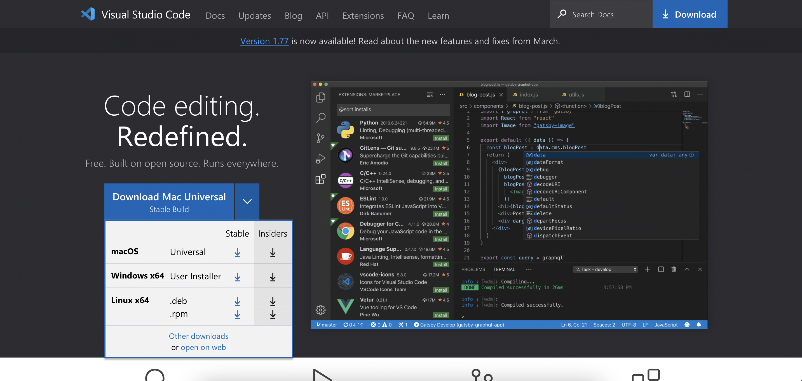

Once VScode has been successfully installed, this is what it should (in general) look like.

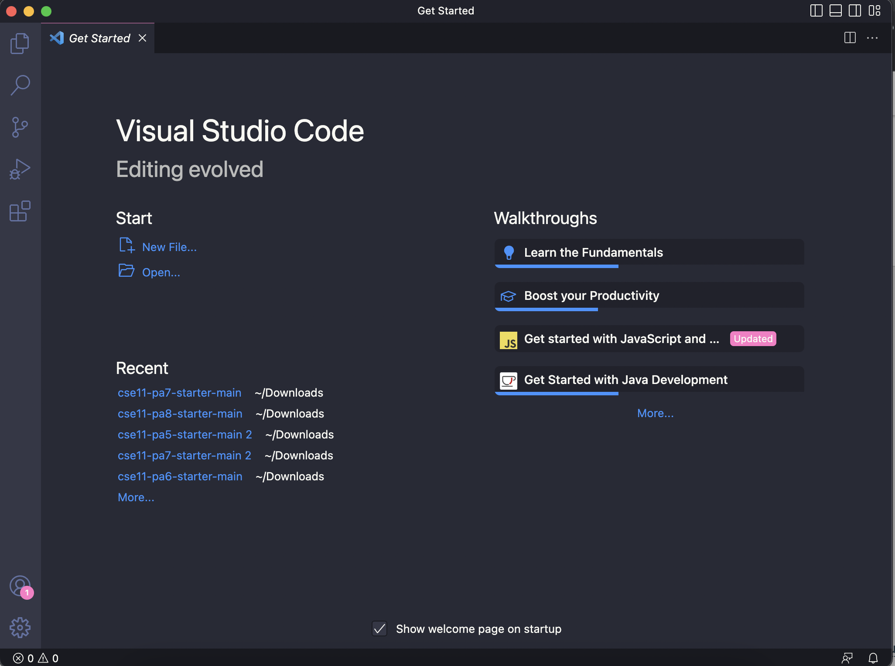


## Step 2 - Remotely Connecting
1. First, you need to look up your course-specific CSE 15L account. Click this [link](https://sdacs.ucsd.edu/~icc/index.php) and log-in using your username and PID.
2. Once logged in, find your CSE15L account username. It should start with "cs15lsp23" followed by 2 unique characters. 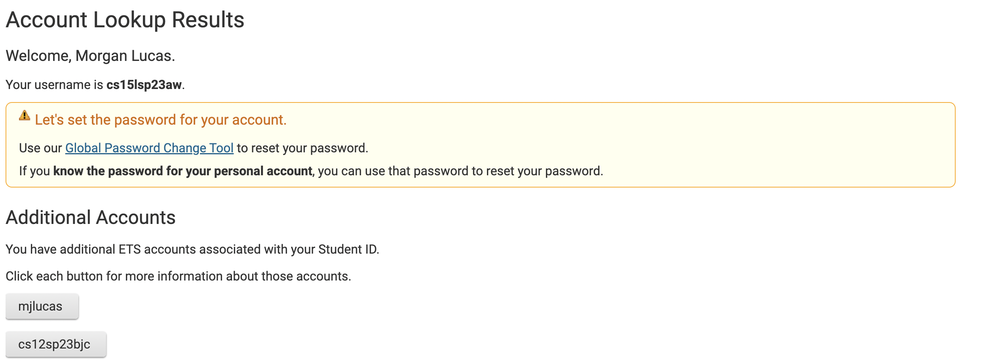
3. Once you have found your username, click the link on-screen [Global Password Change Tool](https://sdacs.ucsd.edu/~icc/password.php) to reset your password for this account. Wait a couple minutes after resetting your password before continuing to the next step. 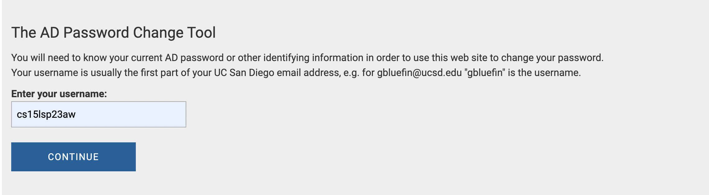
4. *I skipped this step because I am using a Mac*.                                                                                                        If you are on Windows, install Git for Windows at this [link](https://gitforwindows.org/). Once you have Git installed, follow the instructions at this [link](https://stackoverflow.com/questions/42606837/how-do-i-use-bash-on-windows-from-the-visual-studio-code-integrated-terminal/50527994#50527994) in order to use Bash in VScode. If you are not on Windows, skip this step and continue to the next.
5. Open up a terminal in VScode. Enter the following command into the terminal:
```
$ ssh cs15lsp23zz@ieng6.ucsd.edu
```
Replace the "zz" with the two letters in your course-specific account. For example, my account is cs15lsp23aw, so I would enter `$ ssh cs15lsp23aw@ieng6.ucsd.edu`  into the terminal. 
6. Enter your newly-created password when prompted. The terminal should look something like this once finished. 

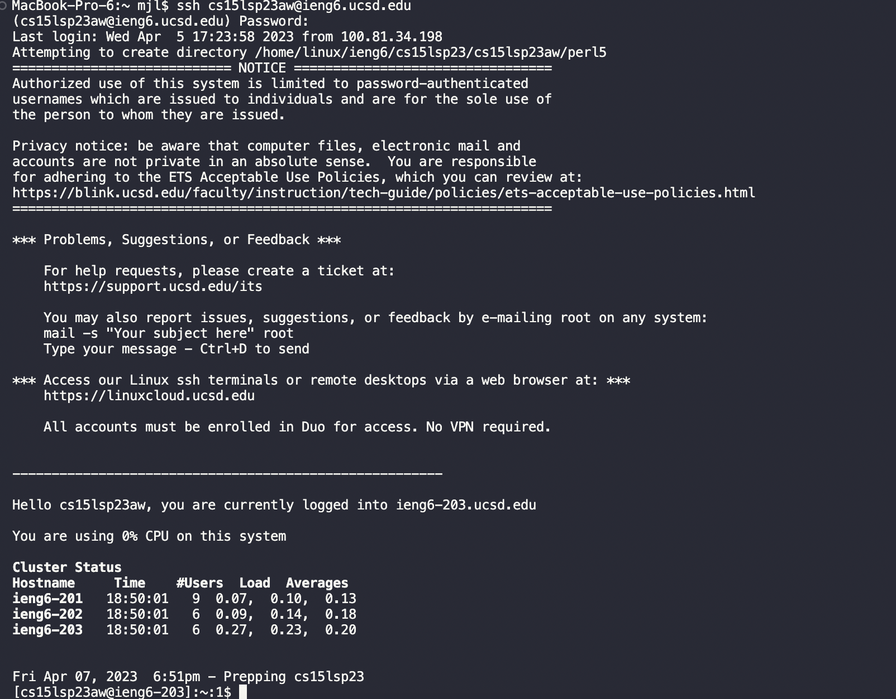. 


## Step 3 - Trying Some Commands
After connecting remotely, the next step is to try some commands. I entered the following commands into the terminal:
- `pwd`
- `ls`
- `ls -lat`
- `cat /home/linux/ieng6/cs15lsp23/public/hello.txt`
- `cd`
- `ls -a`
- `mkdir`
- `cp`

This is what my terminal looked like after entering each of those commands:
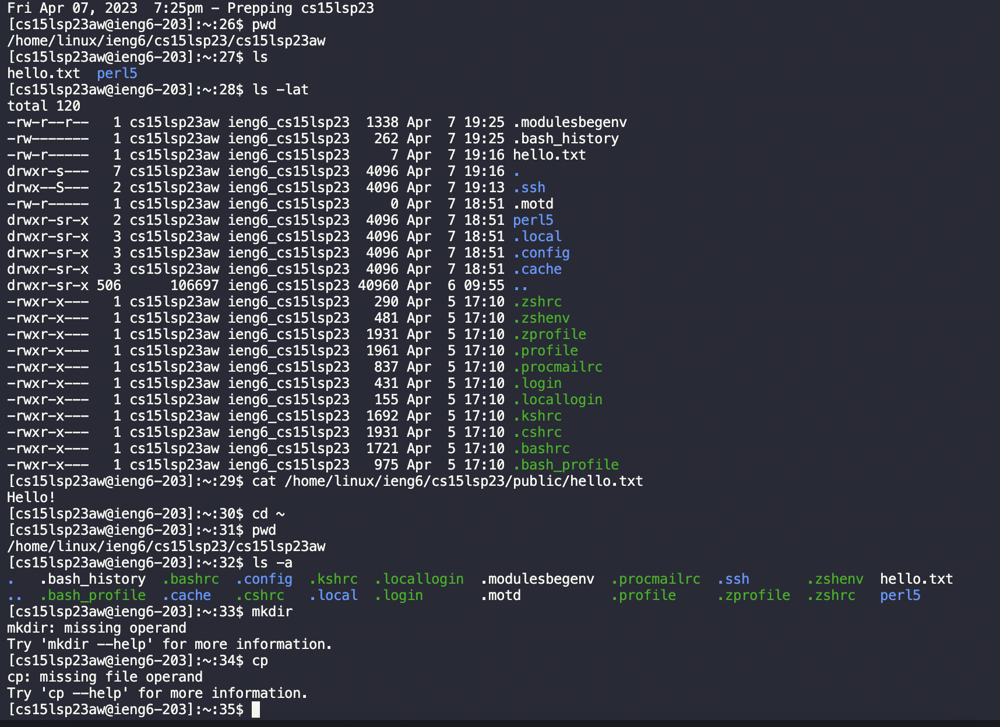


# Lab Report 2
##Part 1
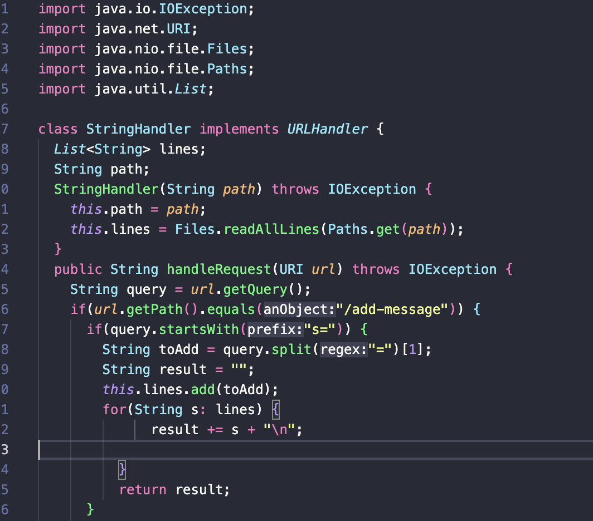
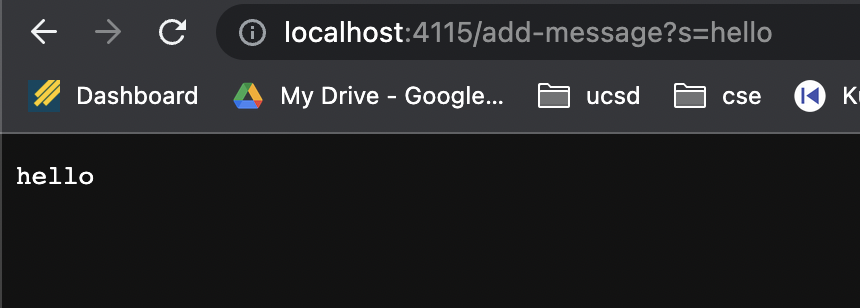


# Lab Report 3
## There are multiple different ways to use the `find` command to search for files or directories based on certain criteria. 
You can use the `find` command to find and list each directory within a given directory. This can be done by entering `find [directory] -type d` into the command line. Below are some examples.

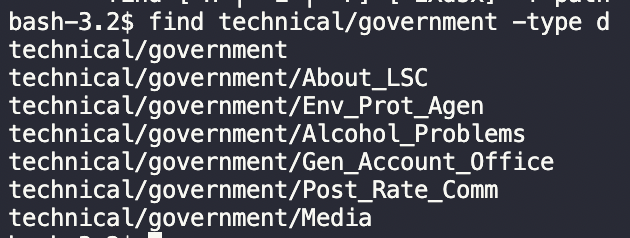

```
$ find technical/government -type d
technical/government
technical/government/About_LSC
technical/government/Env_Prot_Agen
technical/government/Alcohol_Problems
technical/government/Gen_Account_Office
technical/government/Post_Rate_Comm
technical/government/Media
```
The command shown above is searching through and listing each directory in `technical/government`. 

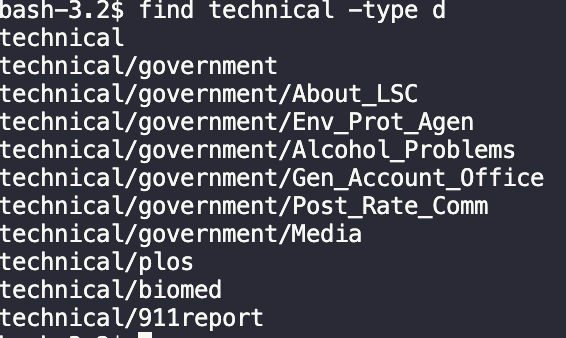

```
$ find technical -type d
technical
technical/government
technical/government/About_LSC
technical/government/Env_Prot_Agen
technical/government/Alcohol_Problems
technical/government/Gen_Account_Office
technical/government/Post_Rate_Comm
technical/government/Media
technical/plos
technical/biomed
technical/911report
```
The command shown above is searching through and listing each directory in `technical`.

You can use the `find` command to delete files within a directory that match a given name. This can be done by entering `find -name [name] -delete` into the command line. Below are some examples.
```
$ find technical -name "chapter-1.txt" -delete
```
The command shown above produces no output, but it deleted the file with the name "chapter-1.txt" under "technical". 
```
$ find technical/government -name "bill.txt" -delete
```
The command shown above produces no output, but it deleted the file with the name "bill.txt" under "technical/government".


The third way to use the `find` command is to use `-size +[number]k`, which will find and list each file in the given directory that is greater than or equal to number given in kilobytes.
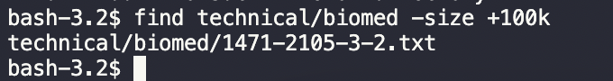
The command shown above is searching through and listing each file in `technical/biomed` whose size is greater than or equal to 100 kilobytes.
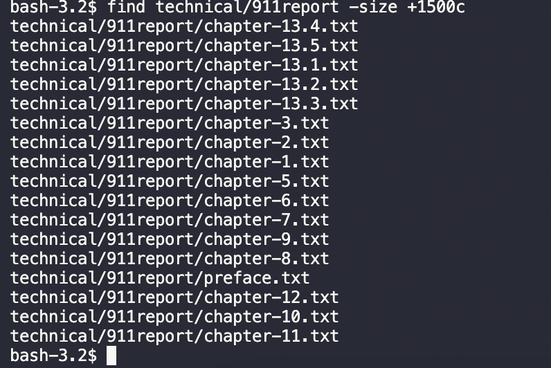
The command shown above is searching through and listing each file in `technical/911report` whose size is greater than or equal to 1500 bytes.


The fourth way to use the `find` command is to use `-mtime -[numer]`, which will find and list each file that was modified within the number of days given. 
.png)
The command shown above is searching through and listing each file in `technical` that has been modified within the past 7 days.
.png)
The command shown above is searching through and listing each file in `technical/911report` that has been modified within the past 3 days.
