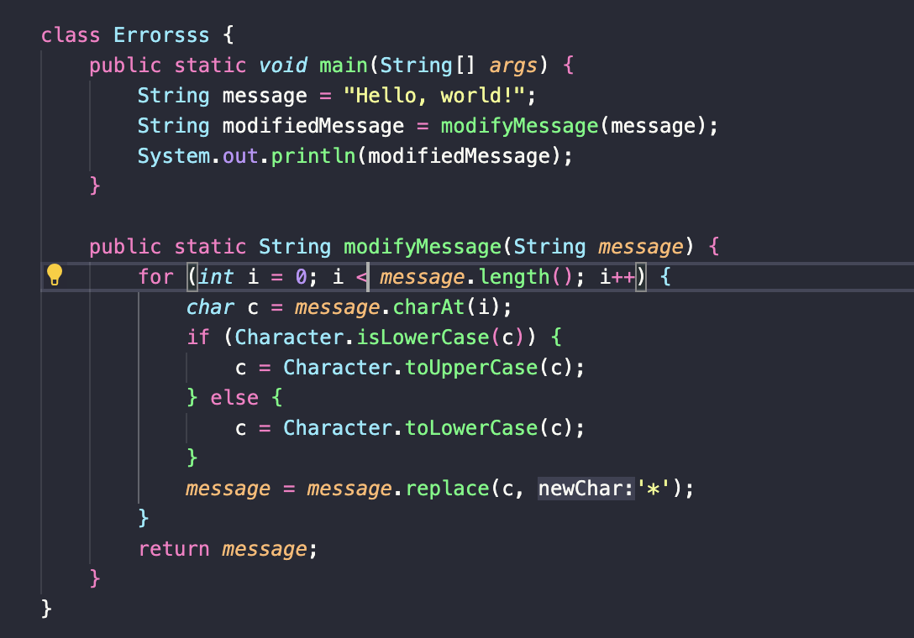

# Lab Report 5

## Debugging Scenario

*TA Response*: According to the information you have provided, your code is producing a runtime error (an IndexOutOfBoundsException error). The issue seems to be in line 10 of your code. Review line 10 to see what could be causing this error. 

*After fix*: Code successfully compiles and runs. The bug was in the header of the forloop. It intially would keep iterating over indices up to and equal the length of some string. This will result in an IndexOutOfBounds error because the index of a string starts at 0, and iterating to an index up to the length of the string will be outside of the bounds of the last index of the string. 

This code used 2 files, one java file for the java program and a bash script. 

*The code before the fix*

*The code after the fix*

*The bash script used to run the file, which triggered the bug*

*What was editted*
In line 10 of the java program, the for loop header was: `for((int i = 0; i <= message.length(); i++)`. The problem lies in the condition of the forlooop. The "=" is what is causing the error. It must be removed to fix the error. It should instead be `(int i = 0; i < message.length(); i++)`.

## Reflection
I learned about bash scripts, which I think are pretty cool. When doing PA's, it can be tedious to keep typing out the commands to compile and run over and over again. Bash scripts are super helpful because of this, and are something that I was not aware existed before taking this class.
