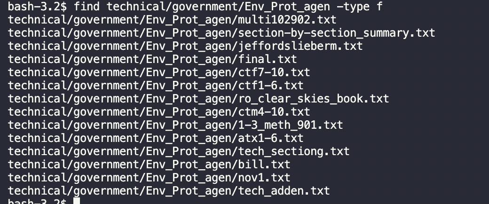

# Lab Report 3

One way to use to `find` command is to use `-type d`, which will find and list each directory in the given directory. 

The command shown above is searching through and listing each directory in `technical/government`. 

The command shown above is searching through and listing each directory in `technical`.

The second way to use the `find` command is to use `-type f`, which will find and list each file in the given directory.

The command shown above is searching through and listing each file in `technical/government/Env_Prot_agen`.
.png)
The command shown above is searching through and listing each file in `technical/government`. 

The third way to use the `find` command is to use `-size +[number]k`, which will find and list each file in the given directory that is greater than or equal to number given in kilobytes.

The command shown above is searching through and listing each file in `technical/biomed` whose size is greater than or equal to 100 kilobytes.

The command shown above is searching through and listing each file in `technical/911report` whose size is greater than or equal to 1500 bytes.

The fourth way to use the `find` command is to use `-mtime -[numer]`, which will find and list each file that was modified within the number of days given. 
.png)
The command shown above is searching through and listing each file in `technical` that has been modified within the past 7 days.
.png)
The command shown above is searching through and listing each file in `technical/911report` that has been modified within the past 3 days.

